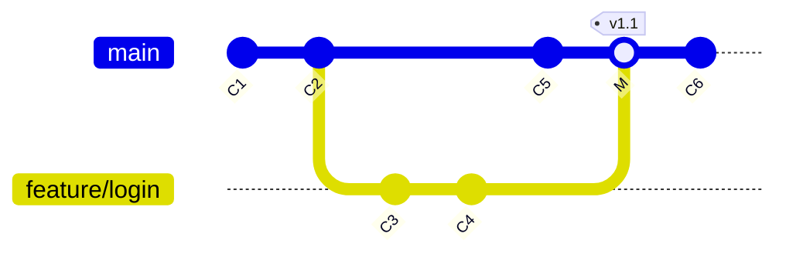

# Pattern: What a branch actually IS (the foundation for every strategy)

Every branching model is just a convention for pointing these 41-byte files at commits.
Understand this and all strategies become obvious.

```bash
cat .git/HEAD                       # "ref: refs/heads/main" — HEAD points at a branch, not a commit
cat .git/refs/heads/main            # the branch IS this file: it contains one commit hash
cat .git/refs/heads/feature/login   # another branch = another file with another hash
cat .git/packed-refs                # after gc, refs are packed into this single file
git show-ref | head                 # every ref in the repo with its hash
git rev-parse main feature HEAD     # resolve any ref to a full hash
git for-each-ref --format='%(refname) %(objectname:short)' | head
```

## The four pieces of the puzzle

```text
┌──────────────────────────────────────────────────────────────────────────┐
│ 1. COMMITS form a DAG — each commit stores its parent hash               │
│                                                                          │
│      C1 ──► C2 ──► C3 ──► C4          (C4 knows C3, C3 knows C2, ...)    │
│                                                                          │
│ 2. A BRANCH is a movable pointer (a file containing one hash)            │
│                                                                          │
│      C1 ──► C2 ──► C3 ──► C4                                             │
│                      ▲       ▲                                           │
│                      │       └── main                                    │
│                      └────────── feature  (created at C3)                │
│                                                                          │
│ 3. HEAD says "which branch am I on"                                       │
│      HEAD ──► refs/heads/feature                                         │
│                                                                          │
│ 4. A COMMIT moves the branch you are on — nothing else                    │
│      C1 ──► C2 ──► C3 ──► C4 ──► C5                                      │
│                      ▲               ▲                                   │
│                      feature         main   ← only main moved            │
└──────────────────────────────────────────────────────────────────────────┘
```

## Why this makes branching free

```bash
time git branch experiment          # ~2 ms: Git writes one 41-byte file
git branch -v                       # no copying of files, no snapshotting — just pointers
```
Compare with SVN/CVS-era branching (a full directory copy). Git's model is why "a branch per task"
is normal and why strategies can afford to be expressive.

## Ref namespaces you must know

```bash
git show-ref | awk '{print $2}' | cut -d/ -f1-3 | sort -u
```
```text
refs/heads/<name>            YOUR local branches
refs/remotes/origin/<name>   remote-TRACKING branches = local CACHE of the remote's state
refs/tags/<name>             tags (lightweight = ref, annotated = its own object)
refs/notes/commits           commit metadata that does NOT change hashes
refs/stash                   your stash stack
refs/pull/42/head            GitHub's magic ref for pull request #42
refs/merge-requests/42/head  GitLab's equivalent
HEAD                         symbolic ref → refs/heads/<current branch>
ORIG_HEAD                    where HEAD was before the last reset/rebase/merge (your undo)
```

## Fast-forward vs three-way merge (the distinction every strategy depends on)

```text
FAST-FORWARD — main has not moved since the branch point
   before:  C1 ──► C2 ──► C3                after:  C1 ──► C2 ──► C3 ──► C4 ──► C5
                     \                                                 ▲       ▲
                      C4 ──► C5  (feature)                             feature main
   → Git just slides the "main" pointer forward. NO merge commit. History stays linear.

THREE-WAY MERGE — both branches moved
   before:  C1 ──► C2 ──► C3 ──► C6   (main)     after:  C1 ─► C2 ─► C3 ─► C6 ─► M   (main)
                     \                                        \                /
                      C4 ──► C5  (feature)                     C4 ──► C5 ─────/  (feature)
   → Git creates M, a commit with TWO parents. History shows the branch as a bubble.
```

```bash
git merge --ff-only feature       # succeed only if a fast-forward is possible
git merge --no-ff feature         # always create a merge commit, even if FF was possible
git merge-base main feature       # the common ancestor used for the three-way merge
git log --oneline --graph --all   # SEE which kind of merge your team is producing
```

## Read your own history like a diagram

```bash
git log --oneline --graph --all --decorate -20
```
```text
*   9f2c1ab (HEAD -> main) Merge branch 'feature/login'     ← --no-ff produced this
|\
| * 7d4e5fa (feature/login) feat: add JWT refresh
| * 3a1b2c3 feat: add login endpoint
|/
* 5e6f7a8 chore: bump deps
* 1c2d3e4 init
```
- `*` a commit, `|` a branch line, `|\` and `|/` where branches split and rejoin
- `--decorate` prints the refs (branch names, tags, HEAD) attached to each commit
- A perfectly straight line = fast-forwards or rebases (trunk-based/GitHub Flow)
- Bubbles and merges = `--no-ff` policy (GitFlow, GitLab Flow)

## Mermaid version (renders on GitHub/GitLab)



## Practice

```bash
git switch -c demo-a                 # create a branch
echo a > a.txt && git add -A && git commit -m "on demo-a"
git switch main && echo m > m.txt && git add -A && git commit -m "on main"
git log --oneline --graph --all      # observe the split — this is the three-way merge situation
git merge --ff-only demo-a           # fails: main has moved, so no fast-forward is possible
git merge --no-ff demo-a -m "merge demo-a"   # creates the merge commit with two parents
git cat-file -p HEAD                 # look at the merge commit: TWO "parent" lines
git log --oneline --graph --all      # observe the bubble
```
