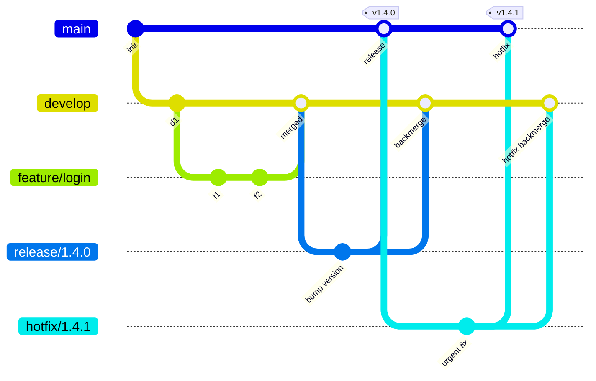

# Pattern: GitFlow — the classic two-branch model

Created by Vincent Driessen (2010). Built for **versioned products** released on a schedule:
desktop software, mobile apps, on-prem installations, anything where "version 1.4.2" means something
to a customer.

## The full diagram

```text
                 ┌── hotfix/1.3.1 ──┐                    (emergency patch, from the TAG)
                 │                  ▼
 main      ──●───┼──────●───────────●──────────────●──────●──►   only released code
 (master)   │   │      │  tag      │  tag         │      │
            │   │      │ v1.3      │ v1.3.1       │ v1.4 │
            │   │      │           │              │      │
            │   │  ┌───┴───────────┘   ┌──────────┴───┐  │
 release    │   │  │                   │ release/1.4  │  │
            │   │  │                   └──┬────────▲──┘  │
            │   │  │                       │        │     │
 develop ───●───●──●───●────●────●─────────●───●────●─────●──►   integration of features
                            │    │        ▲
 feature                    │    │        │
                            ▼    ▼        │
                feature/login   feature/cart  (short-lived, one per task)
```

**Two permanent branches:**
- `main` (or `master`) — *only* code that has been released. Every commit on it is tagged.
- `develop` — the integration branch. Everything finished lands here first.

**Three supporting branch types, all short-lived:**
- `feature/*` — from `develop`, back into `develop`
- `release/*` — from `develop`, into **both** `main` and `develop`, then tagged
- `hotfix/*` — from `main` (the tag), into **both** `main` and `develop`, then tagged

## Complete command walkthrough (runnable)

```bash
# ---------- setup ----------
git init -b main                              # start with main
git switch -c develop && git push -u origin develop   # create the integration branch
# protect both on the host: no direct pushes, PRs only

# ---------- 1. a feature ----------
git switch develop && git pull                # ALWAYS start from an up-to-date develop
git switch -c feature/PROJ-123-login          # one ticket, one branch
# ...work in small commits...
git add -A && git commit -m "feat(auth): add login endpoint"
git push -u origin feature/PROJ-123-login
# open PR: base = develop (NOT main) — this is the #1 GitFlow mistake

# ---------- 2. cut a release ----------
git switch develop && git pull
git switch -c release/1.4.0                   # the release branch freezes the feature set
# ONLY these changes are allowed now: version bumps, docs, release-blocking fixes
npm version 1.4.0 --no-git-tag-version        # or edit whatever version file you have
git commit -am "chore(release): 1.4.0"
git push -u origin release/1.4.0              # CI runs the full regression suite here

# ---------- 3. ship it ----------
git switch main && git pull
git merge --no-ff release/1.4.0 -m "release 1.4.0"    # into main
git tag -a v1.4.0 -m "release 1.4.0"          # annotated tag = the release artefact
git push origin main --follow-tags
git switch develop
git merge --no-ff release/1.4.0 -m "release 1.4.0 back-merge"   # CRITICAL: back into develop
git push origin develop
git branch -d release/1.4.0 && git push origin --delete release/1.4.0

# ---------- 4. a hotfix on the released version ----------
git switch -c hotfix/1.4.1 v1.4.0             # branch from the TAG, not from develop
# ...minimal fix, plus version bump...
git commit -am "fix(payment): correct rounding; release 1.4.1"
git switch main && git merge --no-ff hotfix/1.4.1 -m "hotfix 1.4.1"
git tag -a v1.4.1 -m "hotfix 1.4.1"
git push origin main --follow-tags
git switch develop && git merge --no-ff hotfix/1.4.1 -m "hotfix 1.4.1 back-merge"
git push origin develop
git branch -d hotfix/1.4.1
```

## The tooling version

```bash
git flow init                    # from git-flow (apt install git-flow / brew install git-flow)
git flow feature start PROJ-123-login
git flow feature finish PROJ-123-login
git flow release start 1.4.0
git flow release finish 1.4.0    # merges to main, tags, back-merges to develop, deletes the branch
git flow hotfix start 1.4.1
git flow hotfix finish 1.4.1
git flow config                  # show the configured branch names
```
Note: `git-flow` is in maintenance mode and most teams now script this in CI instead — the *model*
matters, not the tool.

## Mermaid version (renders on GitHub/GitLab)



## Where GitFlow hurts (know these — they are interview questions)

| Problem | Why it happens | Mitigation |
|---|---|---|
| **Merge hell on `develop`** | everyone integrates at once, late | small PRs, rebase onto develop daily, integrate continuously |
| **Features wait for the release train** | nothing ships until `release/*` completes | feature flags so code can merge to main dark |
| **Two branches to keep in sync** | every release/hotfix must be back-merged | automate the back-merge in CI; never do it by hand twice |
| **`develop` is never deployable** | it holds half-finished work | make develop always green, or you cannot cut a release |
| **History is noisy** | `--no-ff` everywhere creates many merge commits | squash features before merging into develop |
| **Poor fit for CI/CD** | the model assumes scheduled releases | use GitHub Flow / trunk-based for continuous delivery |

## When GitFlow is genuinely the right choice

- You ship **versioned artefacts** to customers who stay on old versions (on-prem, SDKs, mobile, firmware).
- You must maintain **multiple versions in parallel** (`support/1.x`, `release/1.4` patch lines).
- Releases are **scheduled events** with a stabilisation/QA window and a release manager.
- Regulatory or contractual reasons require a clear, auditable "what was in v1.4.0".

**When it is the wrong choice:** a web service deployed continuously from one branch — GitFlow adds
ceremony and delay without benefit.
