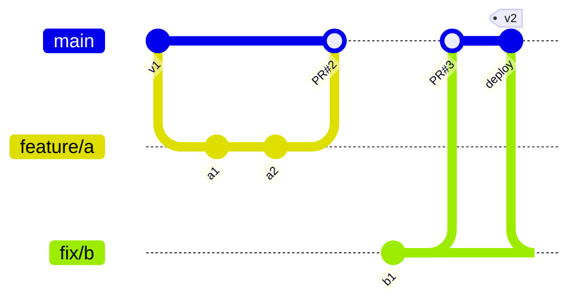

# Pattern: GitHub Flow — main + short-lived branches + continuous deploy

The simplest model that works for a service you deploy continuously. One rule above all others:
**anything in `main` is deployable.**

## The diagram

```text
                    ┌── feature/a ──┐
                    │               ▼
 main  ──●───●──────●───────────────●──────●───────●──────●──►  deploy after every merge
         ▲   ▲      ▲               ▲      ▲       ▲      ▲
         │   │      │               │      │       │      └ deploy
         │   │      │               │      │       └ merge PR #4 (squash)
         │   │      │               │      └ deploy
         │   │      │               └ merge PR #3
         │   │      └ merge PR #2 (feature/a)
         │   └ deploy
         └ merge PR #1
                    │
              ┌─────┴─────┐
              │ fix/b     │  ← branches live hours to 2 days, then are DELETED
              └───────────┘

 There is NO develop branch and NO release branch. main is the only long-lived branch.
```



## The full cycle

```bash
git switch main && git pull --ff-only            # 1. always start from an up-to-date main
git switch -c feat/PROJ-123-coupon-codes         # 2. small, named branch
# 3. commit in small steps — push early and often so your work is backed up
git add -p && git commit -m "feat(coupon): validate code format"
git push -u origin feat/PROJ-123-coupon-codes    # 4. publish (open a Draft PR immediately)
git fetch origin && git rebase origin/main       # 5. stay current DAILY, not at review time
git push --force-with-lease                      # 6. publish the rebase safely
gh pr create --draft --fill                      # 7. PR with title/body from your commits
gh pr ready                                      # 8. mark ready when CI is green
gh pr checks --watch                             # 9. watch required checks
gh pr view --comments                              # 10. read review comments
# 11. merge (squash is the usual policy), then the branch auto-deletes
gh pr merge --squash --delete-branch
git switch main && git pull --ff-only            # 12. resync; the deploy pipeline fires automatically
```

## What makes it work (the non-Git half)

| Requirement | Why |
|---|---|
| **CI under ~10 minutes** | reviewers and authors both wait on it; slow CI kills small-PR culture |
| **Required status checks + branch protection** | nothing broken reaches main |
| **Automated deploy from main** | if deploying is manual, people batch changes → long branches |
| **Rollback that is fast and boring** | `git revert` + redeploy, or redeploy the previous artefact |
| **Feature flags** | merge unfinished work dark; expose it later without a branch |
| **Small PRs (<400 lines)** | review quality collapses above ~400 lines |
| **Preview environments per PR** | review behaviour, not just code |

```bash
# the rollback that GitHub Flow assumes you have
git revert --no-edit <bad-merge-or-commit> && git push    # forward fix: safest
git switch main && git reset --hard <previous-sha>        # only if truly nobody pulled
# better: redeploy the previous immutable artefact (image tag / build number)
kubectl rollout undo deployment/api                       # platform-level rollback, seconds
```

## GitHub Flow vs GitFlow — the essential difference

```text
GitFlow:     feature → develop → release/* → main → deploy        (batched, scheduled)
GitHub Flow: feature → main → deploy                              (continuous, one step)
```
GitFlow optimises for **controlling what ships in a version**. GitHub Flow optimises for
**shortening the time from idea to production**.

## Variants you should be able to name

- **GitHub Flow + release tags:** tag `main` periodically (`v2026.09.15` calendar versioning) for
  traceability without adding branches.
- **Environment branches (→ GitLab Flow):** add `staging`/`production` when promotion is required.
- **Release branches (→ Release Train):** add `release/1.4` when customers stay on old versions.
- **Trunk-Based Development:** the same shape, with stricter rules (branch lifetime < 1–2 days,
  mandatory flags, often direct-to-trunk commits for tiny changes).

## When NOT to use GitHub Flow

```text
✗ You ship versioned artefacts customers install and stay on  → GitFlow / release trains
✗ You cannot deploy to production safely or quickly           → fix that first, or use GitLab Flow
✗ Regulated promotion through environments is mandatory       → GitLab Flow
✗ Multiple teams merge to main dozens of times a day with weak CI → you need a merge queue + flags
```
