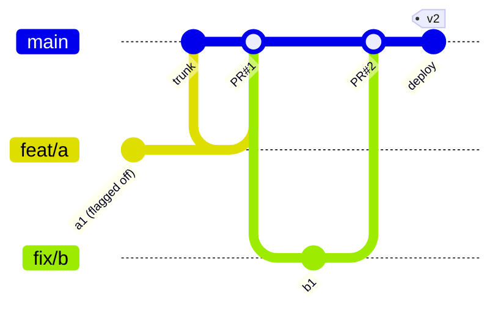

# Pattern: Trunk-Based Development — one branch, small batches, feature flags

The model behind elite-performing teams (DORA/Accelerate). One long-lived branch — the **trunk**
(`main`). Everyone integrates into it at least once a day. Unfinished work is hidden at *runtime*
with flags, not at *version-control* level with branches.

## The diagram

```text
 PURE trunk-based (Google-style, small team or very high discipline)

 trunk ──●───●───●───●───●───●───●───●───●───●───●──►  deploy from trunk, many times a day
         ▲   ▲   ▲   ▲   ▲   ▲
         │   │   │   │   │   └  direct commits or 1-day branches, all reviewed
         └───┴───┴───┴───┴── small, always-integrated changes


 WITH short-lived branches (the common practical form)

 trunk ──●───────●───────●───────●───────●───────●──►
          \     / \     / \     / \     /
           ●───●   ●───●   ●───●   ●───●
           branch   branch  branch  branch      lifetime: HOURS to 2 days max
           (PR)     (PR)    (PR)    (PR)        deleted immediately on merge

 KEY: no develop, no release/*, no environment branches.
      Half-finished features sit in trunk behind a flag:
        if (flags.enabled("new-checkout")) { ... }   ← merged, tested, but invisible
```



## The daily loop

```bash
git switch main && git pull --rebase                 # 1. sync with the trunk
git switch -c feat/PROJ-123-coupon-ui                # 2. branch (lifetime < 2 days)
# 3. work in small commits; hide incomplete behaviour behind a flag
git commit -am "feat(coupon): UI behind flag new_coupon_ui"
git push -u origin feat/PROJ-123-coupon-ui
gh pr create --draft --fill                          # 4. open a Draft PR on DAY ONE for early feedback
git pull --rebase origin main                        # 5. re-sync AT LEAST daily
git push --force-with-lease
gh pr checks --watch                                 # 6. green CI
gh pr merge --squash --delete-branch                 # 7. merge, branch auto-deleted
# 8. CI deploys to production automatically; the flag keeps the feature dark
```

## Feature flags — the mechanism that makes it possible

```python
# runtime flag evaluation (LaunchDarkly / Unleash / Flagsmith / Split / homegrown)
if flags.enabled("new_checkout", user): newCheckout() else legacyCheckout()
```
```text
Flag types and lifetimes (know the difference — it's an interview question):
  RELEASE flag   hides unfinished work          → short-lived (days), MUST be removed
  OPS flag       degrades/kills a feature       → long-lived, owned by SRE
  EXPERIMENT flag A/B test assignment           → lives as long as the experiment
  PERMISSION flag  entitlement per customer     → permanent, part of the product
```
```bash
# flag debt is real debt — track and retire it
grep -rn "flags.enabled(" src/ | wc -l                # how many flags exist
grep -rn "new_coupon_ui" src/ | head                  # is a "temporary" flag still here after 6 months?
# automate removal: create a ticket the day the flag hits 100% rollout
```

## The rules that make it work (say these in an interview)

| Rule | Why |
|---|---|
| Integrate into trunk **at least daily** | divergence is the enemy; small merges never hurt |
| Branch lifetime **< 1–2 days** | long branches = big-bang integration = risk |
| PR size **< ~400 lines / < 20 files** | review quality and revertability |
| **Every** risky change behind a flag | merge ≠ release; decouple deployment from release |
| CI **< 10 minutes** | slow CI forces batching, which kills the model |
| Trunk is **always green and deployable** | `main` broken = everyone blocked |
| Rollback is **boring and fast** | revert + redeploy, or flip the flag off (seconds) |
| Tests are **owned, fast, non-flaky** | flaky tests destroy trust in the trunk |

```bash
# the guardrails you can enforce mechanically
git config --global pull.rebase true                       # linear trunk
git config --global rebase.autoStash true
git config --global rerere.enabled true                    # replay conflict resolutions
# CI checks:
git diff --shortstat origin/main...HEAD                    # PR size gate
git log --oneline origin/main..HEAD | wc -l                # commit count gate
git merge-tree --write-tree origin/main HEAD >/dev/null 2>&1 && echo CLEAN || echo CONFLICT  # pre-flight (Git 2.38+)
```

## Trunk-based vs GitHub Flow — what is actually different?

```text
GitHub Flow:  short-lived branches + PRs + deploy from main           (the shape)
Trunk-Based:  the same shape, PLUS explicit rules:
                • integrate at least daily (cadence is a rule, not a hope)
                • feature flags mandatory for incomplete work
                • release branches ONLY for patches to old versions
                • often: "release branches" replaced by release tags / artefact promotion
```
They are cousins. Trunk-based is the *discipline*; GitHub Flow is the *mechanics*.

## Release branches in trunk-based development (the allowed exception)

```bash
git tag -a v1.5.0 <trunk-sha> -m "release 1.5.0"       # PREFERRED: tag the trunk, promote the artefact
# only when you must patch an old version:
git switch -c release/1.5 v1.5.0                        # from the TAG
git cherry-pick -x <fix-sha>                            # minimal fixes only
git tag -a v1.5.1 -m "patch" && git push origin release/1.5 --follow-tags
git switch main && git cherry-pick -x <fix-sha>         # bring the fix forward to trunk
git branch -d release/1.5                               # delete when the version is EOL
```

## Costs and honest failure modes

```text
✗ Without fast CI (< 10 min) it collapses into "everyone merges broken code into main"
✗ Without flags, unfinished work forces long branches → you get GitFlow by accident
✗ Flaky tests destroy the "trunk is always green" invariant → invest in quarantine + ownership
✗ Flag debt: hundreds of stale flags become unreadable code → retire them automatically
✗ Harder for juniors without strong pairing/review culture
✗ Requires deploy automation, observability and rollback — otherwise a bad merge is an outage
```
