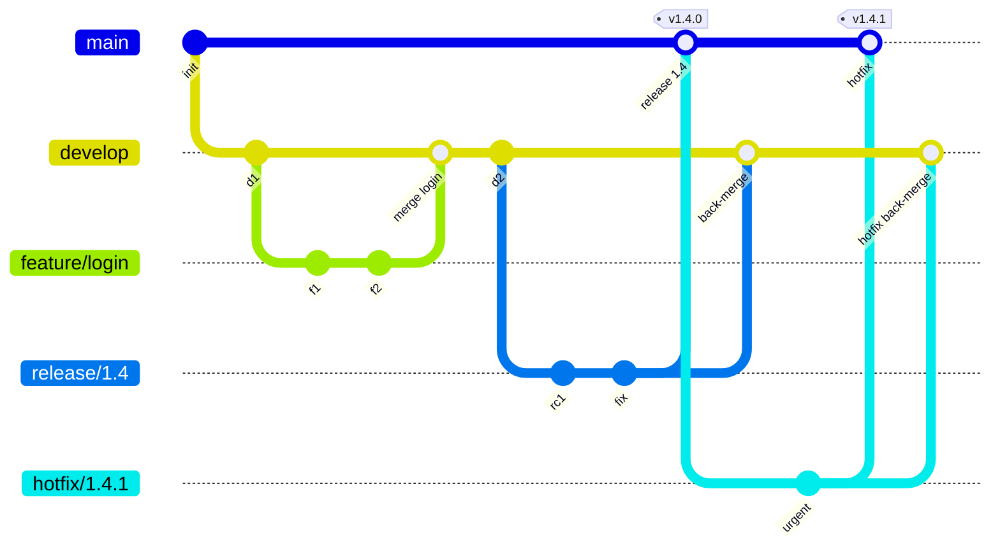
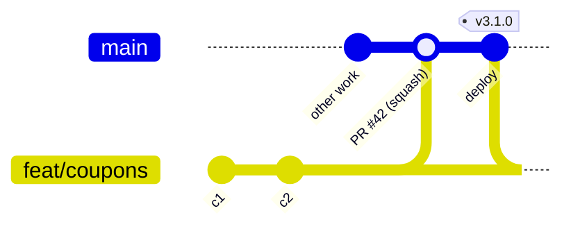
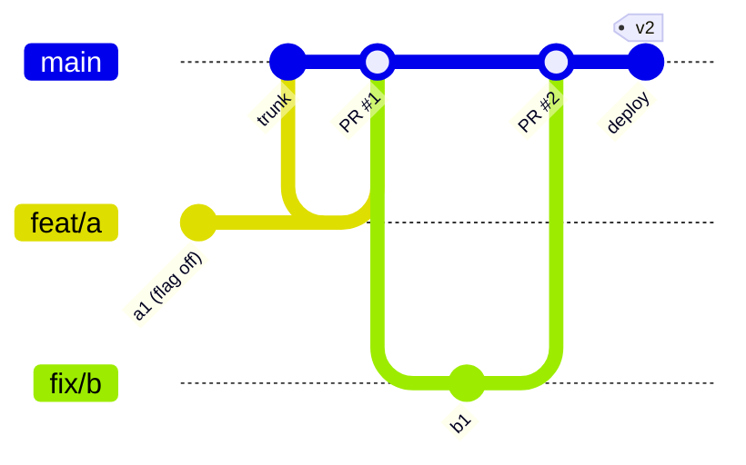

# DIAGRAMS — every branching-strategy diagram in one file

ASCII diagrams are primary (they render anywhere, including offline). Mermaid versions follow for
tools that support them (GitHub, GitLab, Obsidian, Notion).

**How to use:** in an interview, draw the ASCII version. It takes 20–30 seconds and is universally
understood.

---

## 1. The universal picture — every strategy is this, with different rules

```text
        ┌──────────────────────────────────────────────────────────┐
        │                    INTEGRATION BRANCH(ES)                │
        │      main / trunk   (+ develop, env branches, …)         │
        └───▲──────────▲──────────▲──────────▲─────────────────────┘
            │          │          │          │
         merge /    merge /    merge /    merge /        ← HOW they come back
         squash     rebase     merge      cherry-pick      (the merge policy)
            │          │          │          │
        ┌───┴───┐  ┌───┴───┐  ┌───┴───┐  ┌───┴───┐
        │ short │  │ short │  │ long  │  │ long  │       ← branch LIFETIME
        │ feat  │  │ fix   │  │release│  │ env   │
        └───────┘  └───────┘  └───────┘  └───────┘

 A branching strategy = 3 decisions:
   1. WHICH long-lived branches exist
   2. HOW LONG short-lived branches may live
   3. HOW changes return (merge / squash / rebase / cherry-pick) and WHO may push where
```

---

## 2. GitFlow (complete)

```text
main     ──●────────────────────●───────────────────────●──────────────►  only releases + hotfixes
           ▲                    ▲                       ▲
           │ merge --no-ff      │ merge --no-ff         │ merge --no-ff
           │                    │                       │
release    │              ┌─────●─────●─────┐           │
           │              │  release/1.4    │           │   stabilise only, then tag v1.4.0
           │              └────────▲────────┘           │
develop    ──●──●──●──●──●──●──●──●──●──●──●──●──●──●──●──●──●──►  integration branch
              ▲  ▲  ▲  ▲        ▲        ▲  ▲
              │  │  │  │        │        │  │
feature       ●──●  ●──●        ●        ●──●      feature/* (from develop, back to develop)
hotfix                                  ●──●       hotfix/* (from main, back to BOTH main+develop)
```



**Rules:** `feature/*` never touches `main`. Release branches take fixes only. Every release/hotfix is
merged back into **both** `main` and `develop`.

---

## 3. GitHub Flow

```text
main  ──●────●────●────●────●────●────●────●────●────●──►  always deployable, deployed on merge
         \  /  \  /  \  /      \  /
          ●●    ●●    ●●        ●●                    short-lived branches (< a few days)
          │     │     │         │
          PR    PR    PR        PR                    review + required checks
          │     │     │         │
          └─────┴─────┴─────────┴──► squash-merge → CI → deploy → (flag on)

 12-step loop: branch from main → commit → open PR (day 1) → review + CI → rebase on main →
               squash-merge → auto-delete branch → CI deploys → verify → flag on → done
```



---

## 4. GitLab Flow — three variants

```text
A) ENVIRONMENT BRANCHES (promotion)
main ──●───●───●───●───●───●───●───●──►  development
        \   │   │   │   │   │   │
         ▼  ▼   ▼   ▼   ▼   ▼   ▼
pre-prod ─●───●───●───●──►              merge/cherry-pick main → pre-production, soak
                   │
                   ▼
prod ──────────────●──►                 merge pre-production → production, deploy
                   ▲
        hotfix on main first, then flows RIGHT through both

        ONE-WAY RULE:  main ─► pre-production ─► production     never backwards


B) RELEASE BRANCHES (versioned software)
main ──●───●───●───●───●───●───●──►
        \           \
  1.4 ───●───●───●───●──►   v1.4.0  v1.4.1  v1.4.2   (patch line, fixes only)
  1.5 ───────────●───●──►   v1.5.0  v1.5.1
  each release branch is cut from main; fixes cherry-pick -x back to main


C) UPSTREAM-FIRST (open source / vendor dependency)
your fork ──●───●───●──►  submit PR upstream FIRST
upstream ───────●───●──►  merged upstream → you pull it back → then ship
                rule: never carry a local-only patch you plan to upstream later
```

---

## 5. Trunk-Based Development

```text
PURE (Google-style)
trunk ──●───●───●───●───●───●───●───●───●───●──►  deploy many times/day, direct commits allowed
         ▲   ▲   ▲   ▲   ▲

PRACTICAL (short-lived branches)
trunk ──●───────●───────●───────●───────●───────●──►
         \     / \     / \     / \     /
          ●───●   ●───●   ●───●   ●───●        lifetime: HOURS → 2 days MAX
          PR      PR      PR      PR           deleted on merge

unfinished work sits IN the trunk, hidden at runtime:
   if (flags.enabled("new_checkout")) { newCheckout() } else { legacyCheckout() }
   ── merged ── tested ── deployed ── but DARK for users
```



---

## 6. Release lines, hotfixes and backports

```text
trunk ──●───●───●(fix)───●───●──►  v2.5 line (features)
                 │
                 ├── cherry-pick -x ──► release/2.4 ──●──► v2.4.3  (features + fixes)
                 ├── cherry-pick -x ──► release/2.3 ──●──► v2.3.7  (security + critical)
                 └── cherry-pick -x ──► support/2.2 ──●──► v2.2.9  (security only)
                                                        └──► tag v2.2-EOL, delete branch

SUPPORT MATRIX      N      features + fixes
                    N-1    security + critical fixes
                    N-2    security only, or EOL

GOLDEN RULE:  fix on trunk FIRST, cherry-pick DOWN.
              Never fix an old branch and merge UP — that reverts newer work.
```

---

## 7. Release train

```text
 week 1-4        week 5          week 6           week 7
┌──────────┐  ┌───────────┐  ┌────────────┐  ┌─────────────┐
│ develop   │─►│ cut        │─►│ stabilise  │─►│ ship         │─► next train starts
│ features  │  │ release/1.5│  │ QA, fixes  │  │ tag + deploy │
└───────────┘  └────────────┘  └────────────┘  └─────────────┘
                                    │
              MISSED THE CUT? ──────┘  your feature waits for train 1.6.
                                       No exceptions — that rule is what makes trains work.
```

---

## 8. Fast-forward vs 3-way merge vs conflict

```text
FAST-FORWARD (main has not moved)
main ──A──B                     →  git merge feat  →  main ──A──B──C   (ref slides, no merge commit)
             \
feat          C

3-WAY MERGE (main has moved)
main ──A──B──D                  →  merge base = B
             \                     combine B→D and B→C  →  merge commit M with two parents
feat          C                  main ──A──B──D──M
                                     \        /
                                      └──C───┘

CONFLICT (both edited the SAME line)
main ──A──B──D  (D changed line 10 to "X")
             \
feat          C  (C changed line 10 to "Y")
              →  Git cannot choose →  <<<<<<< HEAD / ======= / >>>>>>> feat  →  human decides
```
```bash
git merge-base main feat                                       # the B used above
git merge-tree --write-tree main feat >/dev/null 2>&1 && echo CLEAN || echo CONFLICT   # predict conflicts (Git 2.38+)
```

---

## 9. Branch by abstraction / strangler fig (long work without long branches)

```text
week 1        week 3           week 6             week 10            week 12
  │             │                │                  │                  │
  ▼             ▼                ▼                  ▼                  ▼
 seam        new impl        migrate call        dark launch         cleanup
 (interface) (dead code      sites in small      1% → 10% → 100%     delete legacy
 merged      behind flag     PRs, each merged    watch error budget    + delete flag
             OFF) merged

Every step: small, reviewable, deployable, revertable. No branch lives longer than 2 days.
```

```text
EXPAND / CONTRACT (the DB version of the same idea)
 1. EXPAND    add new column/table, nullable, nothing depends on it
 2. DUAL-WRITE  write old + new (behind a flag)
 3. BACKFILL  batched: UPDATE … WHERE id BETWEEN x AND y LIMIT 1000
 4. CONTRACT  switch reads to the new column, gradually
 5. CLEANUP   remove dual-write, drop the old column in a later release
 Each step is backward compatible with the previous release → rollback is always safe.
```

---

## 10. Branch taxonomy

```text
BY LIFETIME      long-lived (main, develop, release/*, env branches)  ← protected, never deleted
                 short-lived (feat/*, fix/*, chore/*)                 ← deleted on merge

BY PURPOSE       feature    new capability        fix       defect
                 hotfix     production emergency  release   stabilise a version
                 experiment A/B test              spike     throwaway investigation

BY PROTECTION    protected  only CI/release manager may push
                 restricted requires review + checks
                 open       anyone may push (personal sandboxes)

STACKED BRANCHES   main ── A ── B ── C     each PR reviews only its own slice
                        part1  part2  part3
                   git rebase --onto main part1 part2   ← re-parent when part1 merges
```

---

## 11. Strategy comparison at a glance

```text
                branches      deploy freq    conflict risk   CI/CD maturity   flags
GitFlow         █████ (5)     ░ (weeks)      █████ high      ░ low            not needed
GitHub Flow     █ (1)         ████ (many/d)  █ low           ███ high         recommended
GitLab Flow     ███ (2-4)     ███ (daily)    ██ medium       ███ high         not needed
Trunk-Based     █ (1)         ████ (many/d)  ░ lowest        ████ very high   MANDATORY
Release Train   ███ (2-3)     ██ (cadence)   ██ medium       ██ medium        recommended
```

| Criterion | GitFlow | GitHub Flow | GitLab Flow | Trunk-Based |
|---|---|---|---|---|
| Long-lived branches | main + develop | main | main + env/release | trunk |
| Deploy frequency | weeks–months | many/day | daily–weekly | many/day |
| Lead time to prod | long | short | medium | shortest |
| Merge-conflict risk | high | low | medium | lowest |
| CI/CD maturity needed | low | high | high | very high |
| Feature flags | no | recommended | no | mandatory |
| Multiple versions | yes | no | yes | yes (patch lines) |
| Regulated promotion | partly | no | yes | no |
| Survives weak tests | yes | risky | risky | no |
| Best fit | versioned/on-prem/mobile | SaaS/web | multi-env/regulated | high-performing platform teams |

---

## 12. The decision tree

```text
                 Deploy continuously & automatically?
                        NO ◄────┴────► YES
                         │              │
      Versioned artefacts │              │ Flags + CI < 10 min?
      customers install?  │              │    NO ◄──┴──► YES
         YES ◄─┴─► NO     │              │     │           │
          │      │        │              │  GitHub Flow   TRUNK-BASED
          │      │        │              │  (build the     DEVELOPMENT
          │      │        │              │   safety net)
          │      └─► Multiple environments with mandatory promotion gates?
          │             YES ──► GITLAB FLOW (environment branches)
          │             NO  ──► GITHUB FLOW + release tags
          └─────► Several versions maintained in parallel?
                     YES ──► GITFLOW or trunk + release/* patch lines
                     NO  ──► trunk + release tags (simplest)
```

---

## 13. Rollback ladder (fastest first)

```text
 1. FEATURE FLAG OFF        seconds      no deploy        best when the change is flagged
        │
 2. REDEPLOY PREVIOUS       minutes      no code change   best for a bad artefact/config
    ARTEFACT (digest)
        │
 3. git revert + redeploy   minutes      forward fix      the default for a bad commit
        │
 4. git revert -m 1 <merge> minutes      undo a merge     mainline parent = 1
        │
 5. ROLL FORWARD            hours        fix + ship       when reverting is riskier than fixing
        │
 6. reset --hard + force    NEVER on a shared/published branch — destroys other people's work
```
```bash
git revert --no-edit <sha> && git push          # 3
git revert -m 1 --no-edit <merge-sha> && git push   # 4
git reflog --date=iso | head                    # recovery if someone did 6 anyway
```

---

## 14. Promotion of an immutable artefact (the GitLab-Flow ideal)

```text
        build ONCE                       promote the SAME digest
 trunk ──► CI ──► artefact v1.4.0+sha.abc1234 ──► dev ──► staging ──► prod
                    (digest: sha256:9f2c…)        same bits, different config

 "what is in production?" → a digest, not a branch. No drift is possible.
```
